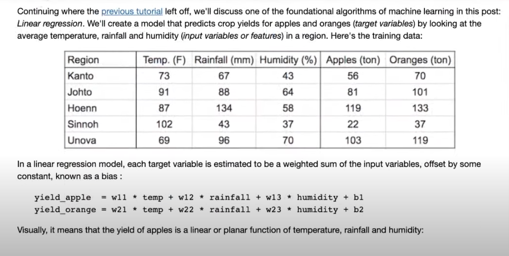
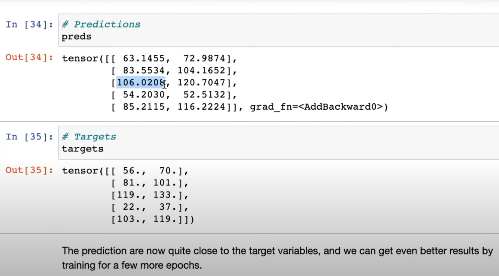

# 🎯 **Linear Regression: From Basics to Beyond** 🚀

Welcome to **THE** repository for exploring the world of **Linear Regression** with PyTorch! From mastering **One-Dimensional Linear Regression** 🧮 to scaling up with **Multi-Dimensional Linear Regression** 🌐, this repo is your ultimate guide to one of the most fundamental concepts in Machine Learning! 💡



---

## 🌟 **Project Highlights**

✨ **One-Dimensional Linear Regression**  
> Learn the basics of how a single feature predicts a single target.  
> 🔍 *Simple, intuitive, and perfect for beginners.*

✨ **Multi-Dimensional Linear Regression**  
> Scale up to handle **multiple input features** and **multi-target outputs**.  
> 🌟 *Ideal for tackling real-world data challenges.*

✨ **Why Linear Regression?**  
> Linear Regression is the **foundation** of many Machine Learning models and is a great place to start your ML journey! 🚀

---

## 🛠️ **Getting Started**

### 🔧 **Prerequisites**
Make sure your system is ready:
- 🐍 Python 3.7+
- ⚡ PyTorch (`pip install torch`)
- 🔢 Numpy (`pip install numpy`)

### 📂 **Installation**
1️⃣ Clone the repo:  
```bash
git clone https://github.com/JaganFoundr/Linear_Regression.git
cd Linear_Regression
```  
2️⃣ Explore the individual folders for 1D and Multi-Dimensional LR.

---

## 🔥 **Visual Overview**

| 🧮 **One-Dimensional Regression** | 🌐 **Multi-Dimensional Regression** |
|:---------------------------------:|:-----------------------------------:|
|  |  |
| *Understanding the core concepts.* | *Tackling real-world complexities.* |

---

## **📜 Walkthrough**

### 🟢 **One-Dimensional Linear Regression**  
- Implements regression **from scratch** using PyTorch.  
- Fully manual updates of weights and biases to build intuition.  
- Optimizes the model with **gradient descent**.  

🚦 **Key Features**:  
✔ Custom prediction and loss functions.  
✔ Training loop with **1000 epochs** for optimization.  
✔ Clear understanding of how data drives predictions.  

🖥️ **Run it**:  
```bash
python one_dimensional_lr.py
```

---

### 🔵 **Multi-Dimensional Linear Regression**  
- Uses PyTorch’s `nn.Linear` for **seamless parameter management**.  
- Efficient **batch processing** with `DataLoader`.  
- Scales to multiple inputs and outputs.  

🚦 **Key Features**:  
✔ PyTorch modules for abstraction and speed.  
✔ Loss computation using `F.mse_loss`.  
✔ Parameter optimization with **SGD optimizer**.  

🖥️ **Run it**:  
```bash
python multi_dimensional_lr.py
```

---

## 🎉 **Results**

| Model                       | Training Loss  | Final Prediction Error |
|-----------------------------|----------------|-------------------------|
| **1D Linear Regression**    | 🔻 Steady drop | 🚀 Minimal error        |
| **Multi-Dimensional LR**    | 🌟 Optimized   | 💡 Scalable insights    |

---

## 💌 **Why Choose This Repository?**

- **Beginner-Friendly**: Start with basics and scale up!  
- **Hands-On**: Learn by **doing**, not just reading.  
- **Reusable Code**: Easily adapt the modules for your projects!  
- **Open to All**: Because **knowledge grows when shared**. 🌱

---

## 🤝 **Contributing**

We’d ❤️ to have you onboard!  
1️⃣ Fork this repository.  
2️⃣ Create a branch with your feature (`git checkout -b feature-name`).  
3️⃣ Commit your changes (`git commit -m 'Added a cool feature!'`).  
4️⃣ Submit a Pull Request. 🎉  

---

## 🌐 **Connect with Us**

- 💬 **Share your thoughts**: Found this helpful? Let us know on **LinkedIn**!  
- ⭐ **Star the repo**: If you love this project, give it a ⭐ on GitHub!  
- 🛠️ **Build Together**: Share your own implementations with us!  

---

## 📜 **License**

This project is licensed under the **MIT License**—do whatever inspires you with it! 🙌

---

## 🌟 **Acknowledgments**



Special thanks to:  
- PyTorch Devs for their incredible tools!  
- The **open-source community** for inspiring us to share our work!  
- And **YOU** for exploring Linear Regression with us! 🌈

--- 
